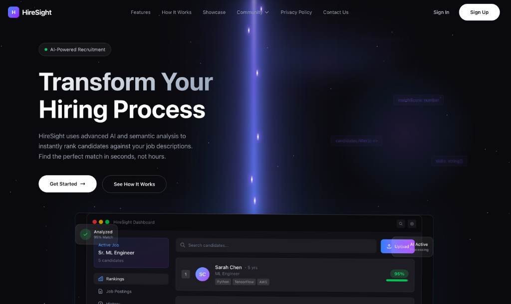
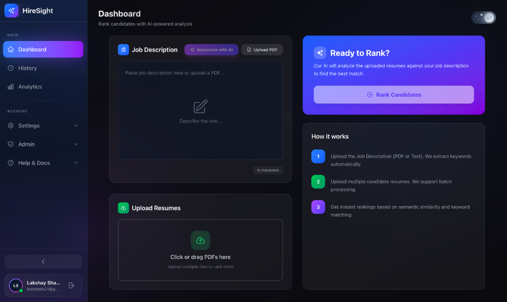
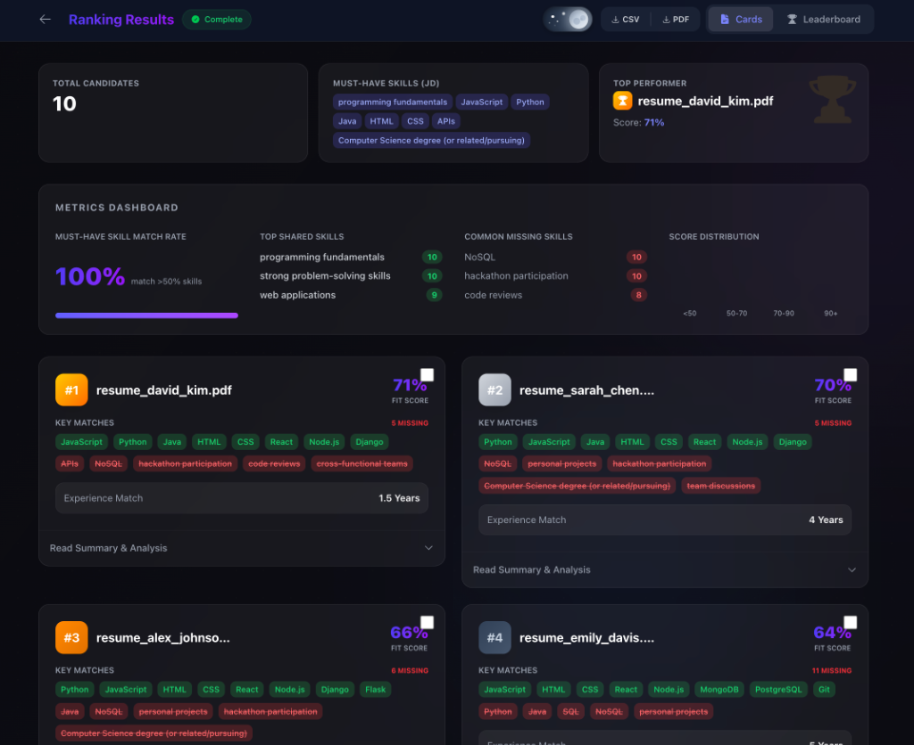
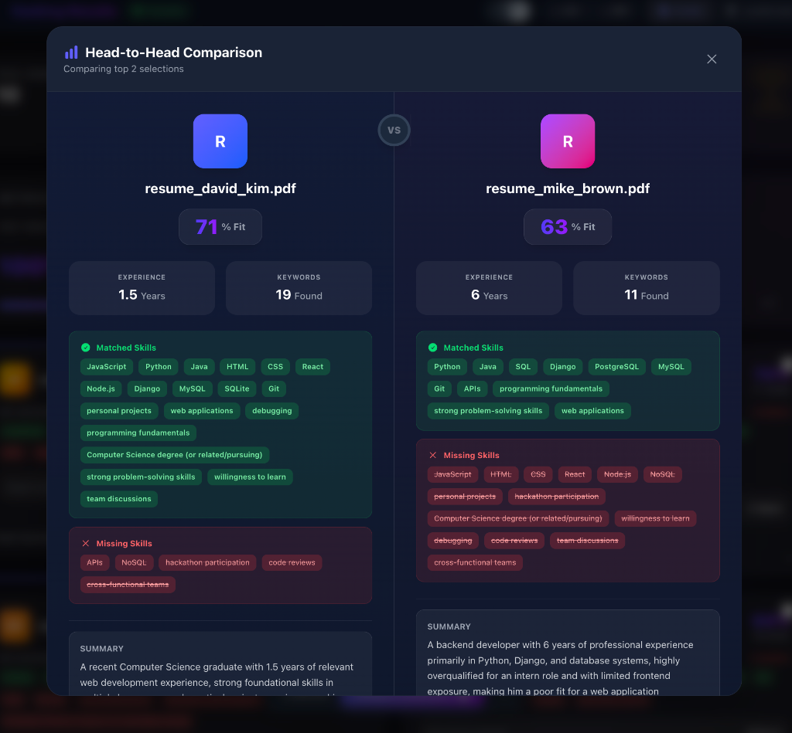

<div align="center">



# 🎯 HireSight

### **AI-Powered Resume Screening & Candidate Ranking Platform**

[](https://nextjs.org/)
[](https://www.tensorflow.org/js)
[](https://ai.google.dev/)
[](https://firebase.google.com/)
[](https://hiresight-delta.vercel.app/)

<br/>

**🚀 Transform your hiring process from hours to seconds with hybrid AI intelligence.**

<br/>

[🌐 Live Demo](https://hiresight-delta.vercel.app/) &nbsp;•&nbsp; [📖 Documentation](#-getting-started) &nbsp;•&nbsp; [🐛 Report Bug](https://github.com/InnoShay/HireSight/issues) &nbsp;•&nbsp; [✨ Request Feature](https://github.com/InnoShay/HireSight/issues)

<br/>

---

</div>

## 🌟 What is HireSight?

**HireSight** is an enterprise-grade AI recruitment platform that revolutionizes how companies screen and rank candidates. Unlike traditional keyword-based ATS systems that reject 75% of qualified candidates, HireSight uses a **hybrid intelligence architecture** combining:

- 🧠 **TensorFlow.js Universal Sentence Encoder** for semantic understanding
- 🤖 **Google Gemini 2.5 Flash** for deep AI analysis and insights
- ⚡ **Real-time processing** with intelligent load balancing

> **The Problem:** Recruiters spend 23+ hours manually screening resumes per hire.
> 
> **Our Solution:** Screen 100+ resumes in seconds with explainable AI insights.

---

## 📸 Screenshots

<div align="center">

### 🏠 Landing Page
*Stunning hero section with cinematic design and floating dashboard preview*


---

### 📊 Dashboard
*Intuitive interface to upload job descriptions and candidate resumes*



---

### 🏆 Ranking Results
*AI-powered candidate rankings with skill matching, scores, and detailed metrics*



---

### ⚔️ Head-to-Head Comparison
*Side-by-side candidate comparison with matched/missing skills and AI summaries*



</div>

---

## ✨ Key Features

<table>
<tr>
<td width="50%">

### 🧠 Semantic AI Matching
TensorFlow.js Universal Sentence Encoder generates 512-dimensional embeddings for deep contextual understanding—not just keyword matching.

### 🤖 Gemini Deep Analysis
Google's Gemini 2.5 Flash extracts skills, experience years, identifies gaps, and generates personalized improvement recommendations.

### ⚡ Two-Stage Ranking
Quick semantic scoring for instant results, followed by deep AI analysis for comprehensive insights.

### 📊 Metrics Dashboard
100% skill match visualization, score distribution charts, and top performer highlights.

</td>
<td width="50%">

### ⚔️ Head-to-Head Comparison
Compare any two candidates side-by-side with matched skills, missing skills, experience, and AI-generated summaries.

### 📧 Email Notifications
Automated alerts when ranking completes, sent directly to your inbox via Nodemailer.

### 🌙 Dark/Light Mode
Beautiful, accessible UI with smooth theme transitions and persistence.

### 📤 Export Options
Download results as CSV, PDF reports, or view interactive leaderboards.

</td>
</tr>
</table>

---

## 🛠 Tech Stack

<div align="center">

| Category | Technologies |
|:--------:|:-------------|
| **Frontend** |      |
| **AI/ML** |   |
| **Backend** |   |
| **Deployment** |  |

</div>

---

## 🏗 System Architecture

```
┌──────────────────────────────────────────────────────────────────────────────┐
│                              USER INTERFACE                                   │
│    ┌──────────────┐    ┌──────────────┐    ┌──────────────────────────────┐  │
│    │   Landing    │    │  Dashboard   │    │   Results + Comparison       │  │
│    │    Page      │    │   (Upload)   │    │   (Rankings + Insights)      │  │
│    └──────────────┘    └──────────────┘    └──────────────────────────────┘  │
└─────────────────────────────────┬────────────────────────────────────────────┘
                                  │
                                  ▼
┌──────────────────────────────────────────────────────────────────────────────┐
│                           NEXT.JS API LAYER                                   │
│  ┌────────────────┐  ┌────────────────┐  ┌────────────────┐  ┌────────────┐  │
│  │ /upload-resume │  │  /quick-rank   │  │/analyze-resumes│  │/optimize-jd│  │
│  │   PDF Parser   │  │ Semantic Score │  │  Gemini AI     │  │  AI Enhance│  │
│  └────────────────┘  └────────────────┘  └────────────────┘  └────────────┘  │
└─────────────────────────────────┬────────────────────────────────────────────┘
                                  │
                ┌─────────────────┼─────────────────┐
                ▼                 ▼                 ▼
   ┌────────────────────┐ ┌─────────────────┐ ┌─────────────────┐
   │   TensorFlow.js    │ │  Gemini 2.5 AI  │ │    Firebase     │
   │  ┌──────────────┐  │ │ ┌─────────────┐ │ │ ┌─────────────┐ │
   │  │  Universal   │  │ │ │ Round-Robin │ │ │ │    Auth     │ │
   │  │  Sentence    │  │ │ │ API Manager │ │ │ │  Firestore  │ │
   │  │  Encoder     │  │ │ │ (7 Keys)    │ │ │ │  Real-time  │ │
   │  └──────────────┘  │ │ └─────────────┘ │ │ └─────────────┘ │
   │         │          │ │        │        │ │        │        │
   │   512-dim Vectors  │ │  Deep Analysis  │ │   Data Store    │
   └─────────┬──────────┘ └────────┬────────┘ └────────┬────────┘
             │                     │                   │
             └─────────────────────┼───────────────────┘
                                   ▼
                    ┌──────────────────────────┐
                    │      SCORE MERGER        │
                    │  Semantic + AI + Bonus   │
                    └────────────┬─────────────┘
                                 ▼
                    ┌──────────────────────────┐
                    │    RANKED CANDIDATES     │
                    │  + Skills + Insights     │
                    │  + Recommendations       │
                    └──────────────────────────┘
```

---

## 🚀 Getting Started

### Prerequisites

```bash
Node.js 18+
npm or yarn
Firebase account
Google AI (Gemini) API key(s)
```

### Installation

```bash
# 1. Clone the repository
git clone https://github.com/InnoShay/HireSight.git
cd HireSight

# 2. Install dependencies
npm install

# 3. Set up environment variables (see below)

# 4. Run the development server
npm run dev

# 5. Open http://localhost:3000
```

---

## 🔐 Environment Variables

Create a `.env.local` file in the root directory:

```env
# ═══════════════════════════════════════════════════════════
# FIREBASE CONFIGURATION
# ═══════════════════════════════════════════════════════════
NEXT_PUBLIC_FIREBASE_APIKEY=your_firebase_api_key
NEXT_PUBLIC_FIREBASE_AUTHDOMAIN=your_project.firebaseapp.com
NEXT_PUBLIC_FIREBASE_PROJECTID=your_project_id
NEXT_PUBLIC_FIREBASE_STORAGEBUCKET=your_project.appspot.com
NEXT_PUBLIC_FIREBASE_SENDERID=your_sender_id
NEXT_PUBLIC_FIREBASE_APPID=your_app_id
NEXT_PUBLIC_FIREBASE_MEASUREMENTID=G-XXXXXXXXXX

# ═══════════════════════════════════════════════════════════
# GEMINI API KEYS (Round-Robin Load Balancing)
# ═══════════════════════════════════════════════════════════
GEMINI_API_KEY_1=your_gemini_key_1
GEMINI_API_KEY_2=your_gemini_key_2
GEMINI_API_KEY_3=your_gemini_key_3
GEMINI_API_KEY_4=your_gemini_key_4
GEMINI_API_KEY_5=your_gemini_key_5
GEMINI_API_KEY_6=your_gemini_key_6
GEMINI_API_KEY_7=your_gemini_key_7

# ═══════════════════════════════════════════════════════════
# EMAIL NOTIFICATIONS (Nodemailer)
# ═══════════════════════════════════════════════════════════
EMAIL_USER=your_email@gmail.com
EMAIL_PASS=your_app_password

# ═══════════════════════════════════════════════════════════
# CONTACT FORM (Web3Forms)
# ═══════════════════════════════════════════════════════════
NEXT_PUBLIC_WEB3FORMS_KEY=your_web3forms_key
```

---

## 📡 API Endpoints

| Endpoint | Method | Description |
|----------|:------:|-------------|
| `/api/upload-resume` | `POST` | Upload and parse PDF resumes, store in Firestore |
| `/api/parse-pdf` | `POST` | Extract text content from PDF files |
| `/api/quick-rank` | `POST` | Fast semantic similarity scoring with TensorFlow.js |
| `/api/analyze-resumes` | `POST` | Deep AI analysis with Gemini (skills, experience, insights) |
| `/api/ai-analysis` | `POST` | Standalone AI insights endpoint |
| `/api/optimize-jd` | `POST` | AI-powered job description enhancement |
| `/api/send-notification` | `POST` | Email ranking results to users |

---

## 📁 Project Structure

```
HireSight/
├── 📂 app/
│   ├── 📂 api/                    # Next.js API routes
│   │   ├── analyze-resumes/       # Gemini deep analysis
│   │   ├── quick-rank/            # TensorFlow semantic scoring
│   │   ├── upload-resume/         # Resume upload handler
│   │   ├── optimize-jd/           # JD enhancement
│   │   └── send-notification/     # Email notifications
│   ├── 📂 components/
│   │   ├── 📂 landing/            # Landing page sections
│   │   ├── AuthGuard.tsx          # Route protection
│   │   ├── Sidebar.jsx            # Navigation sidebar
│   │   └── ThemeToggle.jsx        # Dark/Light mode
│   ├── 📂 dashboard/              # Main dashboard page
│   ├── 📂 results/                # Ranking results page
│   ├── 📂 analytics/              # Usage analytics
│   ├── 📂 history/                # Past rankings
│   ├── layout.tsx                 # Root layout
│   └── page.tsx                   # Landing page
├── 📂 firebase/
│   └── config.js                  # Firebase initialization
├── 📂 lib/
│   └── apiKeyManager.js           # Round-robin API orchestrator
├── 📂 public/
│   └── 📂 screenshots/            # App screenshots
└── 📄 package.json
```

---

## 🎯 How It Works

<table>
<tr>
<td align="center" width="33%">

### 1️⃣ Upload

Upload your **Job Description** (PDF or text) and **candidate resumes**. Our PDF parser extracts text instantly.

</td>
<td align="center" width="33%">

### 2️⃣ Analyze

**TensorFlow.js** computes semantic similarity while **Gemini AI** performs deep skill extraction and gap analysis.

</td>
<td align="center" width="33%">

### 3️⃣ Rank

Get **instant rankings** with fit scores, matched/missing skills, experience validation, and improvement recommendations.

</td>
</tr>
</table>

---

## 📊 Performance Metrics

| Metric | Value |
|--------|-------|
| ⚡ Average Ranking Time | < 5 seconds for 10 resumes |
| 🎯 Semantic Accuracy | 95%+ contextual matching |
| 📈 Throughput | Unlimited (round-robin scaling) |
| 🔒 Uptime | 99.9% (Vercel Edge) |

---

## 🤝 Contributing

We love contributions! Here's how you can help:

1. **Fork** the repository
2. **Create** your feature branch: `git checkout -b feature/AmazingFeature`
3. **Commit** your changes: `git commit -m 'Add AmazingFeature'`
4. **Push** to the branch: `git push origin feature/AmazingFeature`
5. **Open** a Pull Request

---

## 📄 License

Distributed under the **MIT License**. See `LICENSE` for more information.

---

## 🙏 Acknowledgments

<div align="center">

| Technology | Usage |
|:----------:|:------|
| [Google Gemini](https://ai.google.dev/) | Generative AI for deep analysis |
| [TensorFlow.js](https://www.tensorflow.org/js) | Browser-based ML for semantic embeddings |
| [Universal Sentence Encoder](https://tfhub.dev/google/universal-sentence-encoder/4) | 512-dim semantic vectors |
| [Firebase](https://firebase.google.com/) | Authentication & real-time database |
| [Vercel](https://vercel.com/) | Edge deployment platform |
| [Framer Motion](https://www.framer.com/motion/) | Smooth animations |
| [Heroicons](https://heroicons.com/) | Beautiful icons |

</div>

---

<div align="center">

## 👥 Team InnoShay

**Built with ❤️ for the future of hiring**

<br/>

⭐ **Star this repository** if you found it helpful!

<br/>

[🌐 Live Demo](https://hiresight-delta.vercel.app/) &nbsp;•&nbsp; [🐛 Report Bug](https://github.com/InnoShay/HireSight/issues) &nbsp;•&nbsp; [✨ Request Feature](https://github.com/InnoShay/HireSight/issues)

<br/>

---

**© 2025 HireSight by Team InnoShay. All rights reserved.**

</div>
